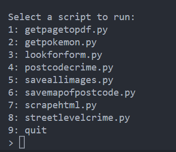

# Readme

## Description

a couple of python scripts to get information from urls written in a file,
written by me Rowan Wood (RowDog) for the purpose of learning python
[Github Repo](https://github.com/mrdiamonddirt)
some of the files require the use of additional python modules, there are instructions on how to install them in the files for each script in a comment at the top of the file.
**_note:_** _these scripts are not intended for use in production, they are for learning purposes only_

## Usage

### run.py

a really simple cli menu to run the other scripts
 

`py run.py`
 
 

type the number of the script you want to run and press enter

### scarpehtml.py

set the url in the script and run
 
`py scrapehtml.py`
 
returns html from a url and saves to a .html file
in the same directory as the script

### getpagetopdf.py

set the url in the script and run
 
`py getpagetopdf.py`
 
returns a pdf of the url and saves to a .pdf file in the same directory as the script

### saveallimages.py

set the url in the script and run
 
`py saveallimages.py`
 
returns all images from a url and saves to a the images folder in the same directory as the script

---

## contributing

if you want to contribute to this project, please fork the repo and make a pull request, i will review it and if it is good i will merge it into the main branch and give you credit for your contribution in the readme file and in the script itself

---

## License

This is free and unencumbered software released into the public domain.

Anyone is free to copy, modify, publish, use, compile, sell, or
distribute this software, either in source code form or as a compiled
binary, for any purpose, commercial or non-commercial, and by any
means.

In jurisdictions that recognize copyright laws, the author or authors
of this software dedicate any and all copyright interest in the
software to the public domain. We make this dedication for the benefit
of the public at large and to the detriment of our heirs and
successors. We intend this dedication to be an overt act of
relinquishment in perpetuity of all present and future rights to this
software under copyright law.

THE SOFTWARE IS PROVIDED "AS IS", WITHOUT WARRANTY OF ANY KIND,
EXPRESS OR IMPLIED, INCLUDING BUT NOT LIMITED TO THE WARRANTIES OF
MERCHANTABILITY, FITNESS FOR A PARTICULAR PURPOSE AND NONINFRINGEMENT.
IN NO EVENT SHALL THE AUTHORS BE LIABLE FOR ANY CLAIM, DAMAGES OR
OTHER LIABILITY, WHETHER IN AN ACTION OF CONTRACT, TORT OR OTHERWISE,
ARISING FROM, OUT OF OR IN CONNECTION WITH THE SOFTWARE OR THE USE OR
OTHER DEALINGS IN THE SOFTWARE.

For more information, please refer to <https://unlicense.org>
